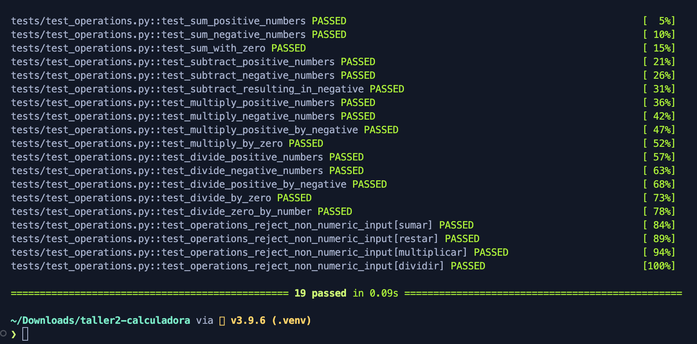
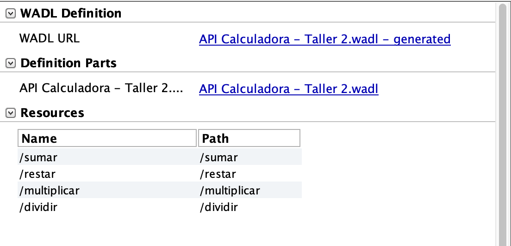
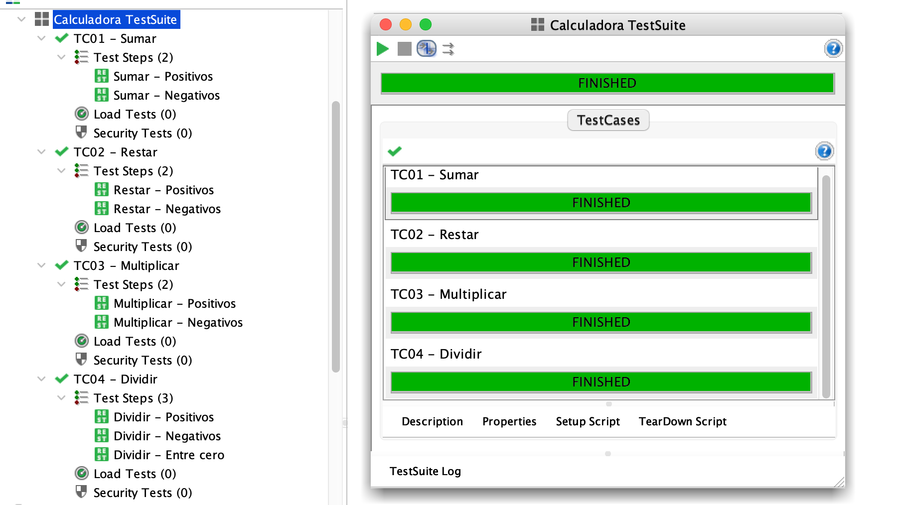
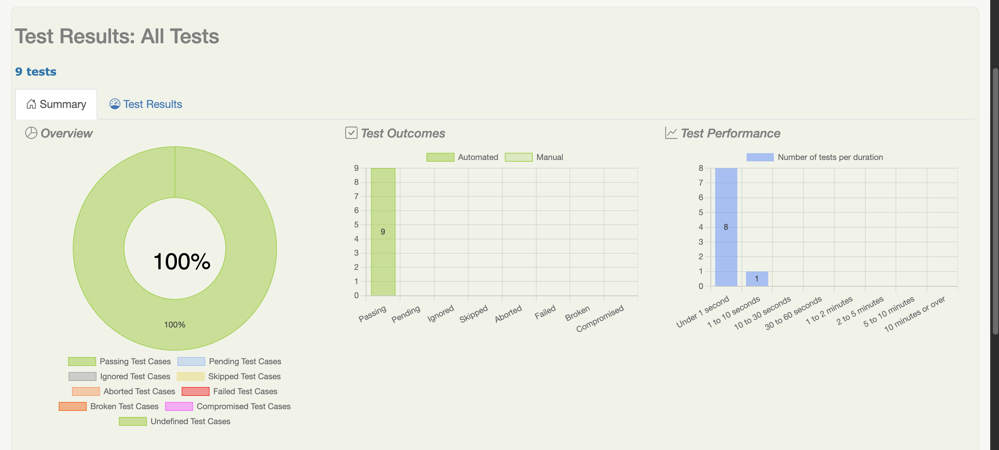
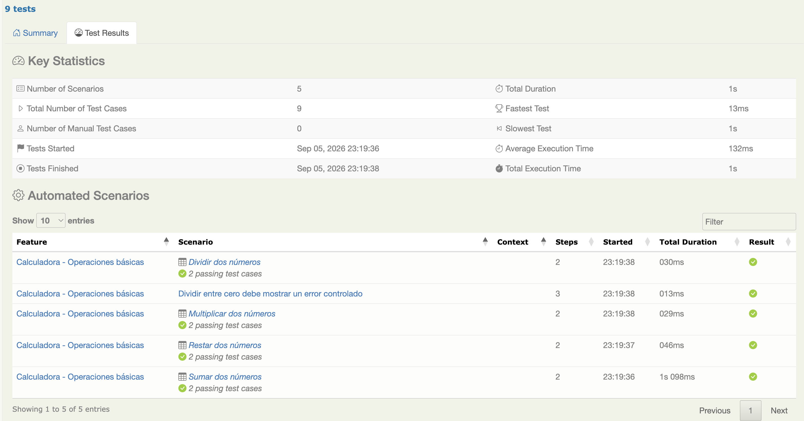

# Taller 2 - Calculadora + Pruebas (Unitarias, Integracion, E2E)

## Proyecto y arquitectura

Calculadora en Python (suma, resta, multiplicacion, division) expuesta como API REST con Flask, validada en 3 niveles: unitarias (pytest), integracion (pytest + SoapUI) y E2E (Serenity BDD). Vive como monorepo: cada herramienta en su propia carpeta, todo se ejecuta desde la raiz.

```
taller2-calculadora/
├── calculadora/          # Logica de negocio pura (sumar, restar, multiplicar, dividir)
├── app.py                # API REST (Flask), puerto 5001
├── tests/                # Pruebas unitarias + integracion (pytest)
├── soapui/                # Proyecto SoapUI (integracion)
├── serenity/              # Proyecto Java/Maven - Serenity BDD + Cucumber (E2E)
├── evidencias/            # Capturas y reportes de ejecucion
└── requirements.txt
```

Nota: la API usa el puerto **5001** (no 5000) porque en macOS el puerto 5000 suele estar ocupado por "AirPlay Receiver". Si necesitas otro puerto, exporta `PORT` antes de levantarla, por ejemplo `PORT=5050 python app.py`.

## Comandos (ejecutar todo desde la raiz)

```bash
# --- Setup inicial ---
git clone <url-del-repo> taller2-calculadora
cd taller2-calculadora
python3 -m venv .venv
source .venv/bin/activate          # Windows: .venv\Scripts\activate
pip install -r requirements.txt

# Reinstalar dependencias Python desde cero (si algo quedo mal)
pip install -r requirements.txt --force-reinstall

# --- Levantar la API (dejar corriendo en otra terminal) ---
python app.py                      # http://localhost:5001

# --- 1. Pruebas unitarias (pytest) ---
python -m pytest tests/test_operations.py -v

# --- 2. Pruebas de integracion (pytest) ---
python -m pytest tests/test_api.py -v

# --- 2.1 Pruebas de integracion (SoapUI) ---
# Requiere la API corriendo (python app.py) y SoapUI Open Source instalado:
# https://www.soapui.org/downloads/soapui/
# Abrir SoapUI -> File > Import Project -> soapui/Taller2-Calculadora-soapui-project.xml
# Ya trae los 4 TestCases y 9 TestSteps armados (2 por operacion, 3 en Dividir)

# --- 3. Pruebas E2E (Serenity BDD) ---
# Requiere Java 11+ y Maven: brew install openjdk@21 maven
# Requiere la API corriendo (python app.py)
mvn -f serenity/pom.xml clean verify
open serenity/target/site/serenity/index.html
```

## 1. Pruebas unitarias (pytest)

Resumen: prueban la logica pura de `calculadora/operations.py` (sin Flask, sin red): positivos, negativos, cero y division entre cero.
Herramienta: pytest.
Tests: 19 pruebas unitarias, todas ejecutadas y en verde.



## 2. Pruebas de integracion (pytest + SoapUI)

**Resumen**: validan que la API HTTP responde bien (codigo, JSON), con la app corriendo o via test client de Flask.

**Herramienta**: pytest (Flask test client) y SoapUI.

**Tests**: 8 TestSteps en SoapUI (2 por operacion).





## 3. Pruebas E2E (Serenity BDD)

Resumen: valida el flujo completo desde la perspectiva del usuario final, en lenguaje de negocio (Gherkin), contra la API real.
Herramienta: Serenity BDD + Cucumber + JUnit 4 (Java/Maven).
Tests: 5 escenarios, 9 casos (suma, resta, multiplicacion, division y division entre cero), con ejemplos positivos y negativos. 100% en verde.




## Comparacion

| Aspecto | Unitarias (pytest) | Integracion (pytest / SoapUI) | E2E (Serenity BDD) |
|---|---|---|---|
| Que prueban | Funciones puras | La API HTTP (endpoints, JSON, codigos) | Flujo completo, lenguaje de negocio |
| Aislamiento | Total | Parcial | Ninguno (sistema real) |
| Velocidad | Muy rapida | Rapida a media | Mas lenta |
| Herramienta | pytest | pytest + SoapUI | Serenity BDD + Cucumber |

## Resumen

Construir la calculadora es solo la mitad del trabajo. Unitarias dan confianza rapida sobre la logica; integracion confirma que esa logica se expone bien a traves de la API; E2E valida que, de principio a fin, el sistema se comporta como espera el negocio - incluyendo el manejo de casos limite como la division entre cero.
